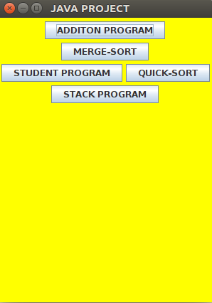
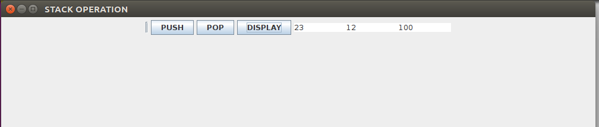
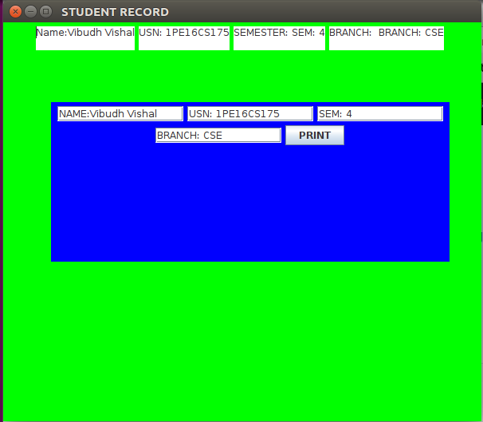

# GUI-BASED-PROGRAM-SIMULATOR
This Repository Consists of a Java Program where a UI based menu driven program is made to show the simulation of different java Programs like Student Information Storage, Merge Sort, Stack operations, Quick Sort, Addition of 2 numbers.

# First-Page
This is how the initial page of the gui tool looks like where u can select the program whose simulation you want to check.

#  Stack Operations

# Student Information 

